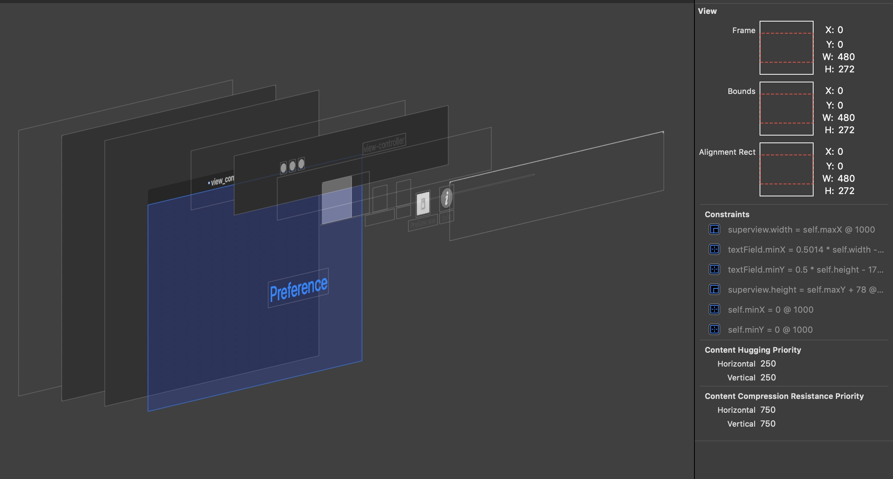
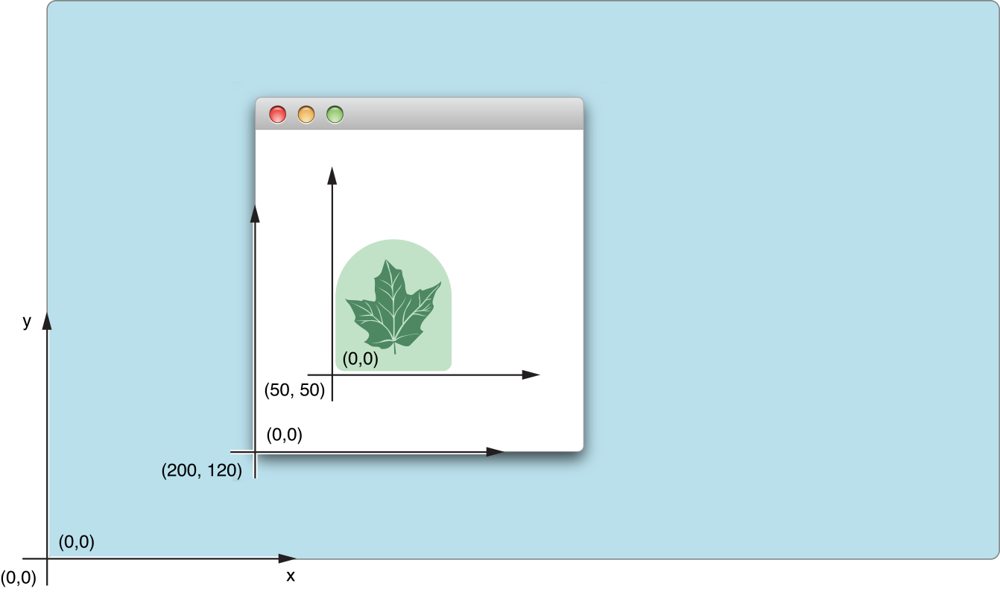
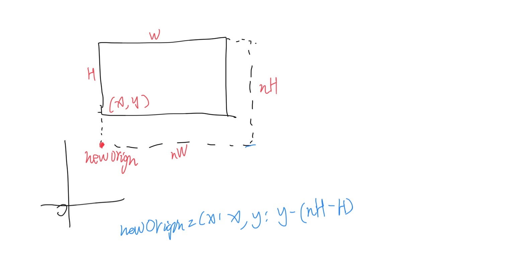

## Window Size Calculation

#### Concept

- frame [NSRect]

    a `frame` is represent the size and coordinate of an `NSWindow`, just like a rectangle.

- origin [CGPoint]
    
    the origin point of the frame rectangle.
    
- size [NSSize]

    the size of the frame(also the window), including the title bar
    
- coordinate system

#### Calculation

to keep the topLeft point of the frame of window in position while resizing, recalculation of both the origin and content size is needed.

